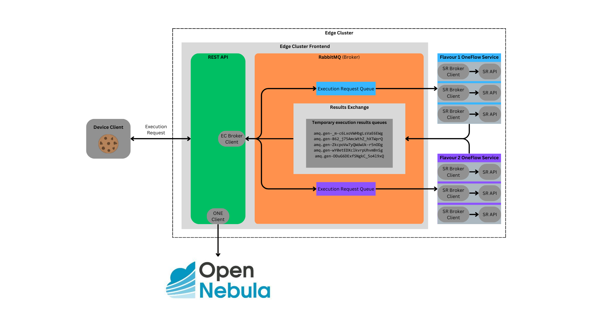

# Edge Cluster Frontend

The Edge Cluster Frontend is the entrypoint for offloading functions from the Device Client in each Edge Cluster. It acts as a load balancer, to handle the redirection to the correct Serverless Runtime running within the particular Edge Cluster where it is located.

## Architecture



The Edge Cluster Frontend has 2 components
- A **REST API**: It handles the execution requests based on functions, parameters and requirements
- A **Broker**: It queues the execution requests based on the requirements and queues the results of these executions.

When a request is issued
- The token is verified based on the cognit frontend public key
- The requested function and requirements are then read from OpenNebula
- An execution request for the Flavour specified in the requirements is placed on a queue dedicated to the Flavour. Each execution request is tagged with an ID.
- A group of [Serverless Runtime](https://github.com/SovereignEdgeEU-COGNIT/serverless-runtime) machines backing that Flavour listen for requests on that queue. Each machine only handles 1 execution at a time.
- The execution result is then sent to the [Results Exchange](https://www.rabbitmq.com/docs/exchanges#direct) with the request ID used as a routing key.
- The REST API connection that queued the execution request is listening for that result on the exchange as well.
- The execution result (either successful or not) is then returned to the Device Client

## Install

The application was developed with **python 3.10**. Check the [dependencies](./requirements.txt).

### Automated

You can use the [Edge Cluster playbook](https://github.com/SovereignEdgeEU-COGNIT/cognit-ops-forge/blob/fb2d35ea6a39098449138dedab1b1e6f4b6f22e1/ansible/playbooks/edge_cluster.yaml#L1-L5) to deploy the application with ansible. This playbook can also deploy it with ssl termination using nginx. An example [inventory file](https://github.com/SovereignEdgeEU-COGNIT/cognit-ops-forge/blob/fb2d35ea6a39098449138dedab1b1e6f4b6f22e1/ansible/inventory_ecf_example.yaml#L1-L16) is provided.

### Manual

It is recommended to create a virtual environment.

Install virtualenv

```bash
pip install virtualenv
```

Create virtualenv

```bash
cd /path/to/cognit-frontend-repo
python -m venv venv
source venv/bin/activate
pip install -r requirements.txt
```

The Application needs to reach
- the OpenNebula Cloud Edge manager endpoints
  - [XMLRPC](https://docs.opennebula.io/6.8/installation_and_configuration/opennebula_services/oned.html#xml-rpc-server-configuration)
  - [oneflow](https://docs.opennebula.io/6.10/installation_and_configuration/opennebula_services/oneflow.html)
- the [cognit frontend](https://github.com/SovereignEdgeEU-COGNIT/cognit-frontend)
- a [rabbitmq broker](https://www.rabbitmq.com/docs/download)

Configure this at [/etc/cognit-edge_cluster_frontend.conf](/share/etc/cognit-edge_cluster_frontend.conf).

Run the application

```bash
./src/main.py
```

It should result in uvicorn starting the web server and logging requests

```log
(venv)  ◰³ venv  ~/P/C/edgecluster-frontend   v1 *  ./src/main.py                                                                                                        53s
INFO:     Started server process [27235]
INFO:     Waiting for application startup.
INFO:     Application startup complete.
INFO:     Uvicorn running on http://0.0.0.0:1339 (Press CTRL+C to quit)
INFO:     127.0.0.1:56536 - "GET /docs HTTP/1.1" 200 OK
INFO:     127.0.0.1:56536 - "GET /openapi.json HTTP/1.1" 200 OK
32
INFO:     127.0.0.1:56548 - "POST /v1/functions/32/execute?app_req_id=28&mode=sync HTTP/1.1" 200 OK
```

Unload the virtual env after stopping the application

```bash
deactivate
```

## Use

The API documentation is available where the api is running, by default at `http://localhost:1338/docs`.

The App client must previously get an auth token issued by the [cognit frontend](https://github.com/SovereignEdgeEU-COGNIT/cognit-frontend?tab=readme-ov-file#use) and send it on the requests header.

### Troubleshooting

Set the `log_level: info` to `debug` in the configuration. This should help with spotting problems easier.

### Issues with cognit frontend

Make sure the [cognit frontend](https://github.com/SovereignEdgeEU-COGNIT/cognit-frontend) is reachable. Otherwise the application will not start

```
Cannot load public key for biscuit token authentication from http://localhost:1338/v1/public_key
HTTPConnectionPool(host='localhost', port=1338): Max retries exceeded with url: /v1/public_key (Caused by NewConnectionError('<urllib3.connection.HTTPConnection object at 0x10fae9600>: Failed to establish a new connection: [Errno 61] Connection refused'))⏎
```

The cognit frontend shares a public key that the edge cluster frontend uses to authorize the execution requests. This means, only auth tokens issued by that cognit frontend are trusted by this edge cluster.

### Issues with permissions

When requesting an execution, the request should pass an **application requirement ID** and a **function ID**. These are the IDs of documents stored in the OpenNebula database. The user requesting the execution needs to be able to [read said documents](https://docs.opennebula.io/6.10/integration_and_development/system_interfaces/api.html#one-document-info).
